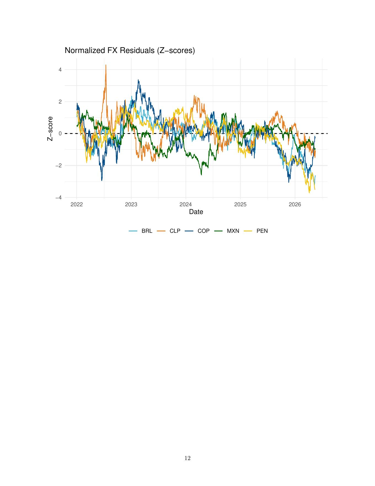

Esta sección deja visible solo el proyecto de ExchangeReg. Los proyectos anteriores pueden seguir en el repositorio para uso interno o desarrollo, pero no quedan enlazados desde la página pública.

## Proyecto principal

::: {.mu-section-intro}
Herramienta aplicada para monitorear desviaciones del tipo de cambio y tasas soberanas a 10 años en economías latinoamericanas respecto de fundamentos externos observables.
:::

::: {.mu-grid .mu-grid-projects}

::: {.mu-card}
::: {.mu-card-thumb}

:::
::: {.mu-card-kicker}
Macrofinanzas LatAm
:::
### Tipo de cambio, tasas largas y stress macrofinanciero

Modelos diarios para CLP, BRL, MXN, PEN y COP que estiman componentes explicados por variables globales y comparan los residuos normalizados de FX y tasas 10Y.

::: {.mu-meta}
**Estado:** proyecto aplicado con resultados gráficos y reporte PDF.  
**Herramientas:** R, tidyverse, ggplot2, modelsummary, BIS, FRED y BCCh.
:::

[Abrir proyecto](proyectos/exchange.qmd){.mu-card-link}
:::

:::

## Agenda de desarrollo

::: {.mu-grid .mu-grid-areas}

::: {.mu-area}
### Validación fuera de muestra
Comparar estabilidad de coeficientes y precisión de ajuste por ventanas temporales, especialmente después de episodios de stress global y shocks locales.
:::

::: {.mu-area}
### Indicador sintético regional
Construir un índice agregado de presión macrofinanciera para LatAm a partir de residuos FX y 10Y, con umbrales por régimen.
:::

::: {.mu-area}
### Extensión económica
Separar movimientos asociados a commodities, dólar global, tasas externas, equity global y riesgo financiero para una lectura más estructurada por país.
:::

:::
