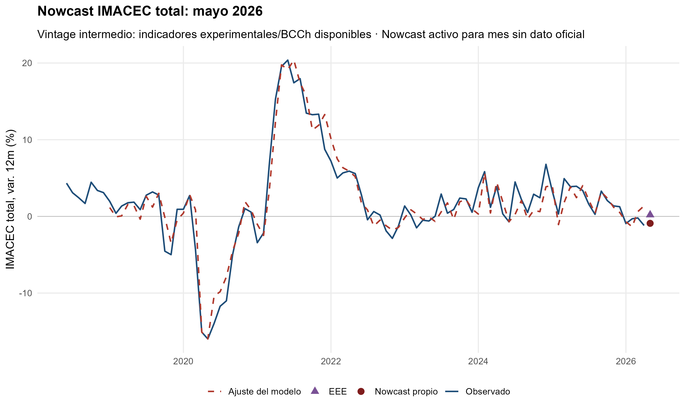
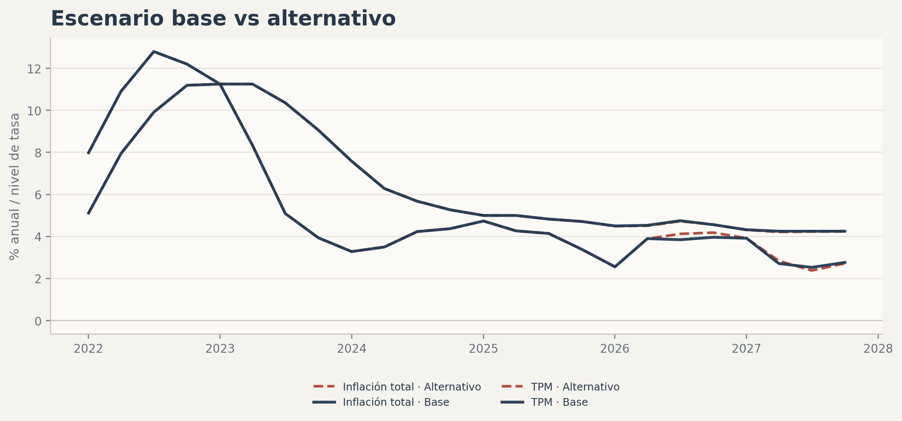
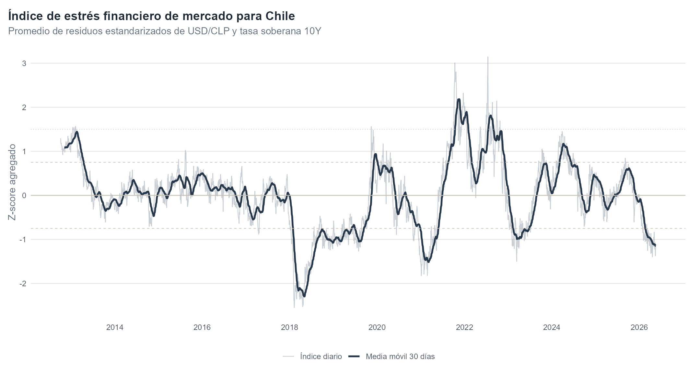

Esta sección reúne proyectos aplicados, notas técnicas y líneas de investigación en macroeconomía, política monetaria, econometría de series de tiempo y visualización de datos. La prioridad es mantener una presentación sobria: pregunta económica clara, datos trazables, metodología explícita y resultados visuales legibles.

## Proyectos principales

::: {.mu-section-intro}
Herramientas y análisis con estructura metodológica más desarrollada, orientados a seguimiento macroeconómico, proyecciones, simulación de escenarios y discusión de política económica.
:::

::: {.mu-grid .mu-grid-projects}

::: {.mu-card}
::: {.mu-card-thumb}

:::
::: {.mu-card-kicker}
Actividad
:::
### Nowcasting de actividad económica en Chile

Modelo mensual en R para anticipar la evolución del IMACEC total y no minero usando indicadores sectoriales, variables calendario, rezagos macroeconómicos y evaluación de ajuste.

::: {.mu-meta}
**Estado:** proyecto aplicado en desarrollo continuo.  
**Herramientas:** R, tidyverse, ggplot2, plotly, series de tiempo.
:::

[Abrir proyecto](proyectos/imacec.qmd){.mu-card-link}
:::

::: {.mu-card}
::: {.mu-card-thumb}

:::
::: {.mu-card-kicker}
Escenarios
:::
### Escenarios macroeconómicos inspirados en IPoM {#escenarios-ipom}

Comparación entre un escenario base basado en IPoM y un escenario alternativo usando supuestos externos, inflación, brecha de actividad, tipo de cambio real y tasa de política monetaria. El foco público está en una comparación limpia y prudente, no en una réplica institucional.

::: {.mu-meta}
**Estado:** proyecto aplicado avanzado.  
**Herramientas:** Matlab, IRIS Toolbox y R.
:::

[Ver proyecto ↗](proyectos/ipom-iris.qmd){.mu-card-link}
:::

::: {.mu-card}
::: {.mu-card-thumb}

:::
::: {.mu-card-kicker}
Política monetaria
:::
### Transmisión de la TPM a tasas de mercado

Análisis visual y econométrico del traspaso de movimientos de la Tasa de Política Monetaria a distintas tasas de mercado en Chile, distinguiendo horizontes, episodios y tipos de tasa.

::: {.mu-meta}
**Estado:** research note en desarrollo.  
**Salida esperada:** pass-through por horizonte, modelos de rezagos distribuidos y lectura macroeconómica prudente.
:::

[Abrir proyecto](proyectos/transmision-tpm.qmd){.mu-card-link}
:::

::: {.mu-card}
::: {.mu-card-thumb}

:::
::: {.mu-card-kicker}
Macrofinanzas
:::
### Índice de estrés financiero de mercado para Chile

Monitor diario que resume desviaciones del USD/CLP y de la tasa soberana 10Y respecto de fundamentos externos observables. El objetivo es distinguir movimientos explicados por condiciones globales de episodios de presión financiera local.

::: {.mu-meta}
**Estado:** proyecto aplicado con datos reales.  
**Herramientas:** R, modelos lineales, residuos estandarizados y visualización interactiva.
:::

[Abrir proyecto](proyectos/estres-externo.qmd){.mu-card-link}
:::

:::

## Prototipos y líneas en desarrollo

::: {.mu-section-intro}
Ideas metodológicas o visuales que todavía requieren consolidación de datos, validación empírica o mayor documentación antes de ser presentadas como proyectos aplicados principales.
:::

::: {.mu-grid .mu-grid-projects}

::: {.mu-card .mu-card-muted}
::: {.mu-card-kicker}
Mercado de tasas
:::
### Curva de rendimiento chilena interactiva

Visualización interactiva de la curva nominal y real, pendiente de la curva y episodios macrofinancieros relevantes para interpretar expectativas, condiciones financieras y primas por plazo.

::: {.mu-meta}
**Estado:** prototipo visual en desarrollo.  
**Próxima mejora:** reemplazar la demo por curvas oficiales/mercado, agregar pendiente 10y-2y y separar curva nominal, real y compensación inflacionaria.
:::

[Abrir prototipo](proyectos/curva-rendimiento.qmd){.mu-card-link}
:::

:::

## Agenda de investigación

::: {.mu-grid .mu-grid-areas}

::: {.mu-area}
### Política monetaria y heterogeneidad financiera
Análisis de la transmisión de la TPM hacia distintos segmentos del mercado financiero, evaluando si el pass-through cambia entre ciclos de alza, baja y normalización monetaria.
:::

::: {.mu-area}
### Proyección macroeconómica y escenarios
Construcción de escenarios alternativos con supuestos externos y juicio doméstico controlado, comparando impactos sobre inflación, TPM y brecha de actividad.
:::

::: {.mu-area}
### Visualización para política pública
Diseño de gráficos reproducibles que comuniquen resultados macroeconómicos sin sobrecargar la lectura ni esconder supuestos relevantes.
:::

:::
