::: {.mu-note}
Este proyecto replica la salida analítica de ExchangeReg en formato web. Se publican resultados, gráficos y reporte final; no se publica el archivo de trabajo original con credenciales ni objetos temporales.
:::

## Motivación

En economías pequeñas y abiertas, el tipo de cambio y las tasas largas reaccionan a condiciones externas: dólar global, VIX, commodities, tasas de EE.UU., equity externo y otros precios financieros. El problema práctico es distinguir cuándo el movimiento observado parece consistente con esos fundamentos y cuándo aparece una desviación residual de mayor interés macrofinanciero.

El objetivo del proyecto es construir una lectura comparable para **CLP, BRL, MXN, PEN y COP**, usando modelos por país y residuos estandarizados.

## Lectura rápida

::: {.mu-kpi-grid}
::: {.mu-kpi-card}
::: {.mu-kpi-label}
Países
:::
::: {.mu-kpi-value}
5
:::
Chile, Brasil, México, Perú y Colombia.
:::

::: {.mu-kpi-card}
::: {.mu-kpi-label}
Frecuencia
:::
::: {.mu-kpi-value}
Diaria
:::
Datos financieros armonizados desde 2010.
:::

::: {.mu-kpi-card}
::: {.mu-kpi-label}
Mercados
:::
::: {.mu-kpi-value}
FX + 10Y
:::
Tipo de cambio bilateral y tasa soberana larga.
:::

::: {.mu-kpi-card}
::: {.mu-kpi-label}
Salida
:::
::: {.mu-kpi-value}
z-score
:::
Residuos normalizados para comparar episodios.
:::
:::

## Metodología

La primera etapa estima, para cada país, un modelo de tipo de cambio y un modelo de tasa soberana a 10 años. Los residuos de cada modelo se normalizan como z-scores. Valores positivos o negativos persistentes indican desviaciones respecto del comportamiento explicado por los fundamentos incluidos.

### Modelo de tipo de cambio

El modelo para el tipo de cambio bilateral usa como variable dependiente el logaritmo del FX frente al dólar. Los regresores incluyen tendencia, inflación relativa contra EE.UU., WTI, cobre, Nasdaq, equity China, VIX, dólar multilateral y CNY/USD.

### Índices de precios

La inflación relativa se construye desde índices de precios al consumidor de BIS `WS_LONG_CPI`, en nivel mensual y base 2010=100, para Chile, Estados Unidos, Brasil, Colombia, México y Perú. El índice mensual se convierte a frecuencia diaria mediante interpolación log-lineal y se mantiene plano después del último dato observado. Esto evita el patrón de serrucho que aparecía al reconstruir un CPI diario desde variaciones publicadas en otra frecuencia.

### Modelo de tasa soberana 10Y

El modelo de tasa 10Y usa como regresores la tasa 10Y de EE.UU., VIX, Nasdaq, dólar multilateral, CNY/USD y tendencia. La interpretación es similar: el residuo captura la parte de la tasa local no explicada por esos factores globales en la especificación lineal.

### Segunda etapa

Como chequeo adicional, el proyecto estima la relación entre el residuo cambiario normalizado y el diferencial de tasa soberana 10Y frente a EE.UU. Esta parte no debe leerse como causalidad estructural; funciona como resumen empírico del vínculo entre presión cambiaria y spread largo.

## Resultados globales

::: {.mu-wide-figure}

:::

::: {.mu-wide-figure}
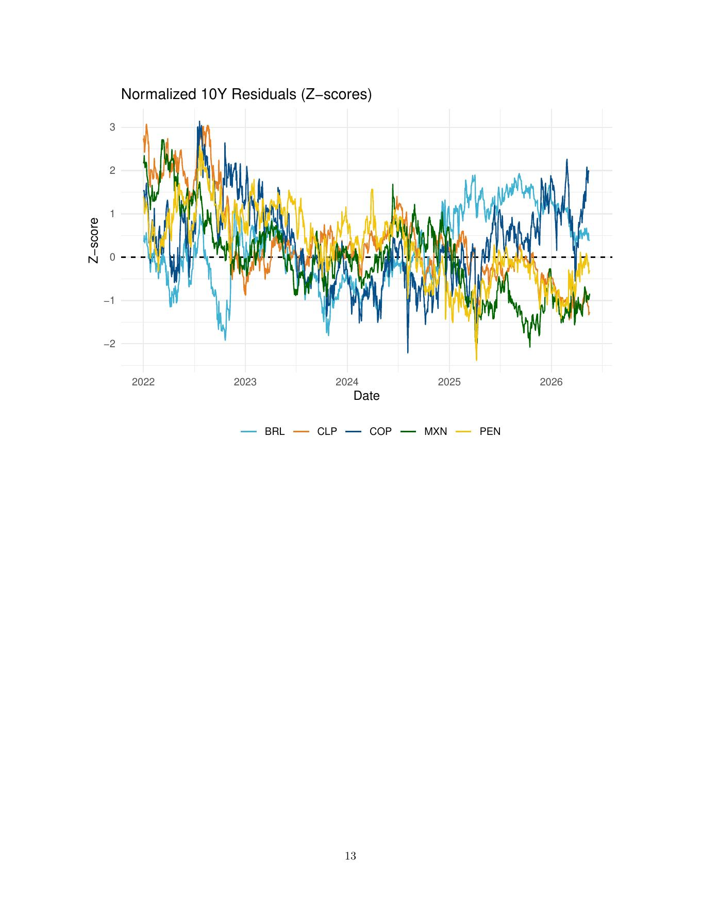
:::

## Diagnóstico de ajuste

| Modelo | CLP | BRL | MXN | PEN | COP |
|---|---:|---:|---:|---:|---:|
| FX - R² | 0.959 | 0.963 | 0.882 | 0.901 | 0.969 |
| FX - RMSE | 0.04 | 0.06 | 0.06 | 0.04 | 0.05 |
| 10Y - R² | 0.646 | 0.605 | 0.907 | 0.646 | 0.824 |
| 10Y - RMSE | 0.62 | 1.32 | 0.44 | 0.63 | 0.92 |

El ajuste del tipo de cambio es alto en todos los países, lo que sugiere que buena parte del movimiento cambiario diario se alinea con fundamentos externos incluidos en la especificación. El ajuste de tasas 10Y es más heterogéneo: México y Colombia muestran mayor capacidad explicativa, mientras Chile, Brasil y Perú dejan una fracción más amplia en el componente residual.

## Stress FX y 10Y por país

::: {.mu-figure-grid}
::: {.mu-chart}
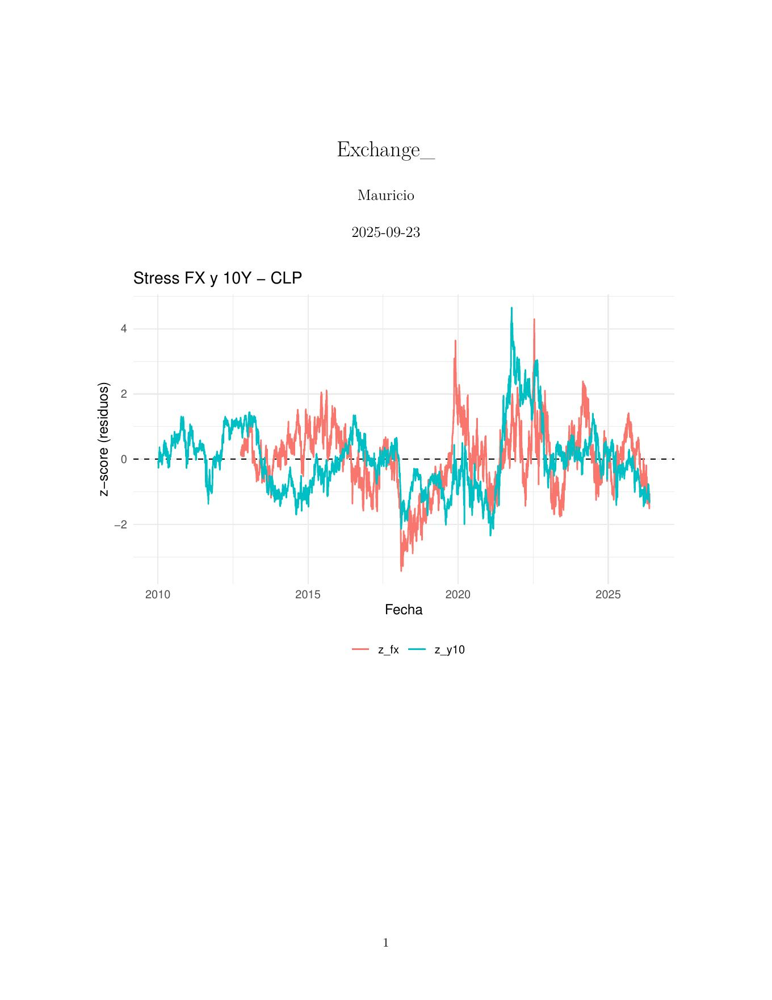
:::
::: {.mu-chart}
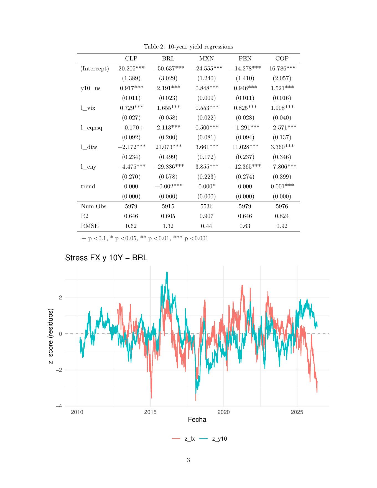
:::
::: {.mu-chart}
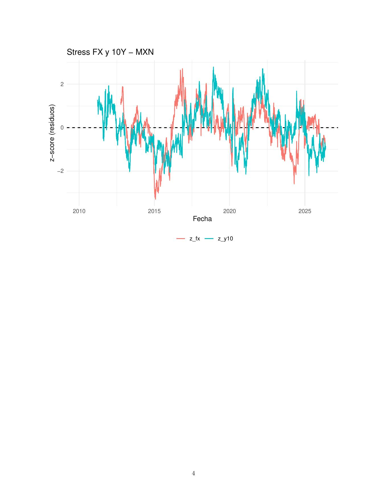
:::
::: {.mu-chart}
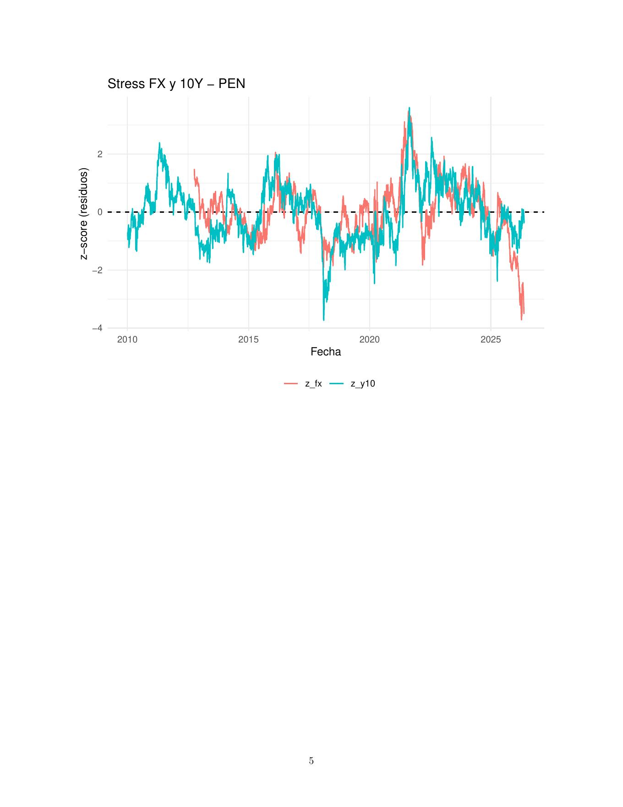
:::
::: {.mu-chart}
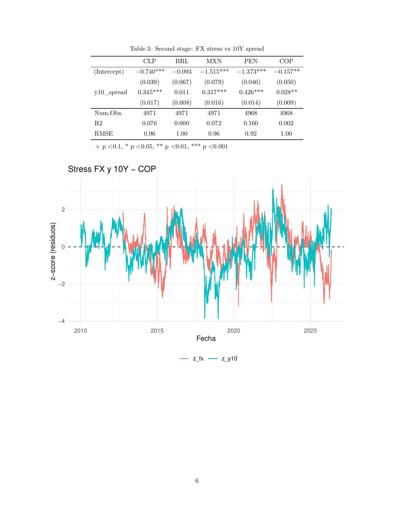
:::
:::

## Segunda etapa: FX residual y spread 10Y

| País | Coeficiente del spread 10Y | R² | Lectura |
|---|---:|---:|---|
| CLP | 0.345 | 0.076 | Relación positiva y estadísticamente significativa. |
| BRL | 0.011 | 0.000 | Relación prácticamente nula en esta especificación. |
| MXN | 0.317 | 0.072 | Relación positiva y significativa. |
| PEN | 0.426 | 0.160 | Relación positiva más marcada. |
| COP | 0.028 | 0.002 | Relación positiva pero económicamente pequeña. |

::: {.mu-figure-grid}
::: {.mu-chart}
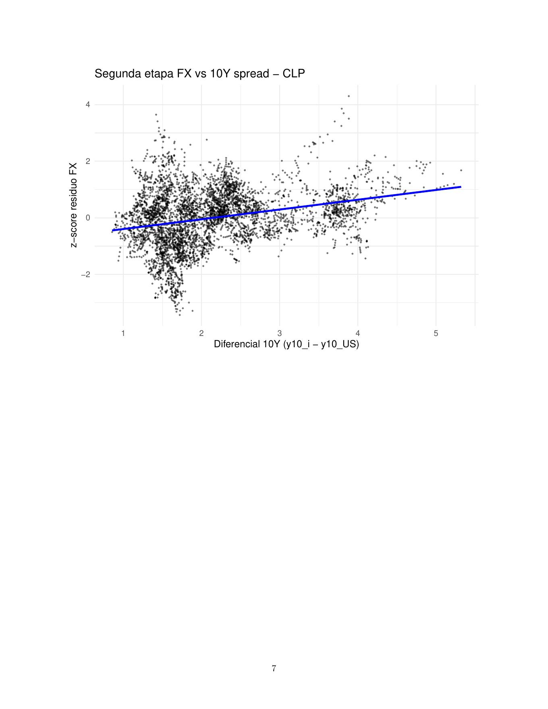
:::
::: {.mu-chart}
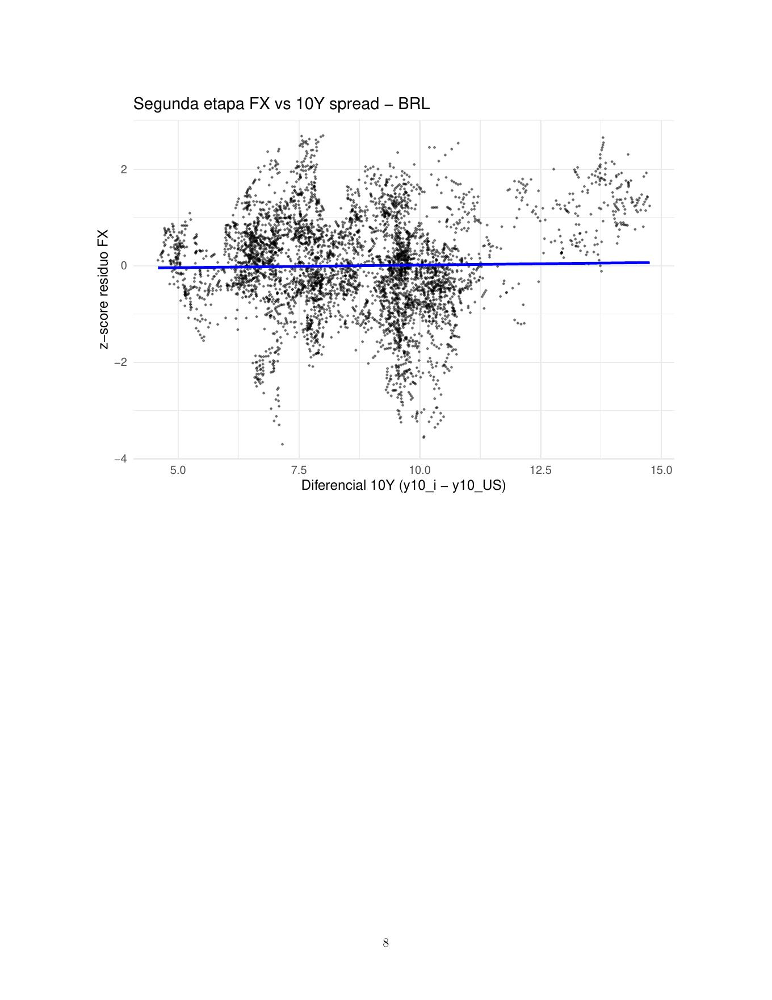
:::
::: {.mu-chart}
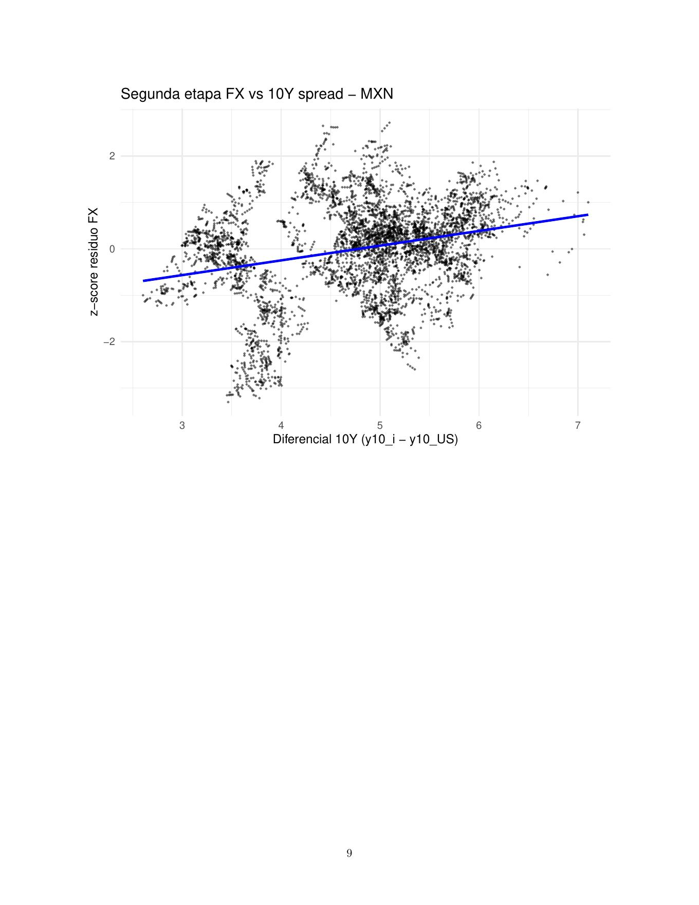
:::
::: {.mu-chart}
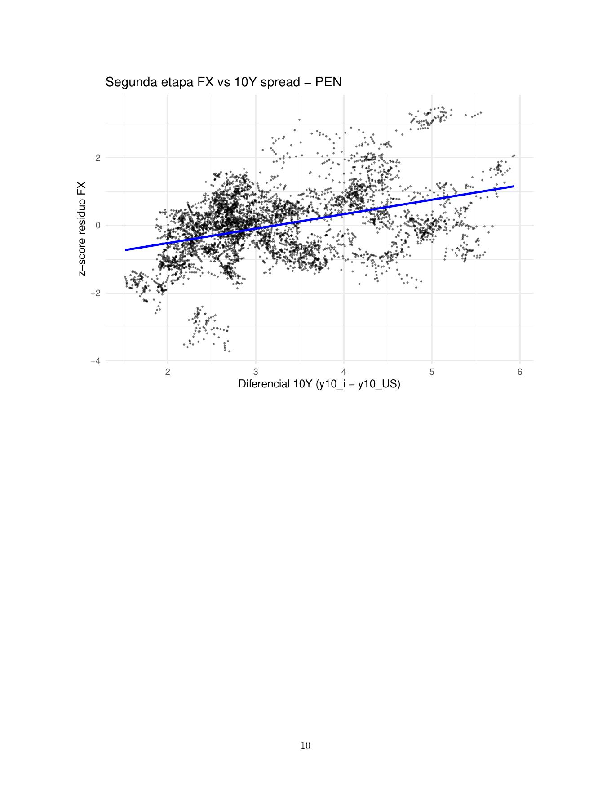
:::
::: {.mu-chart}
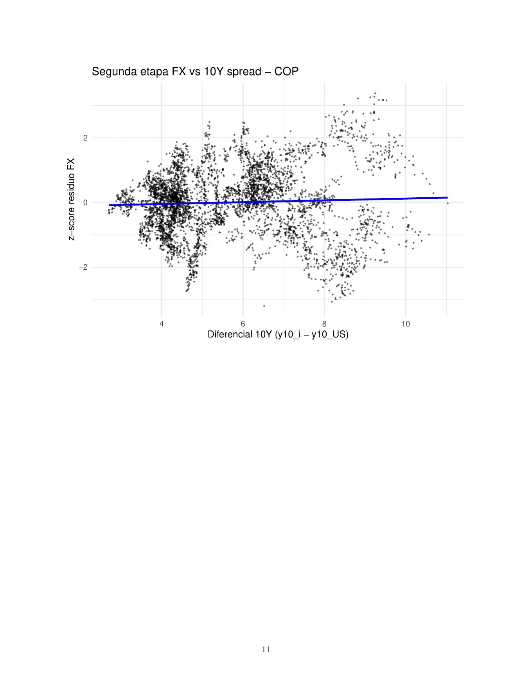
:::
:::

## Interpretación económica

Una lectura útil del ejercicio es pensar en tres capas. Primero, los fundamentos externos explican una parte importante de los movimientos financieros regionales. Segundo, los residuos permiten comparar episodios que no se explican bien por esos fundamentos. Tercero, la relación entre residuo cambiario y spread largo no es homogénea: es más clara para Chile, México y Perú, más débil para Colombia y prácticamente nula para Brasil en esta versión.

La contribución del proyecto no es afirmar que un residuo sea automáticamente un shock doméstico puro. La contribución es entregar una métrica disciplinada para detectar cuándo vale la pena mirar con más atención eventos locales, riesgo político, shocks de liquidez, sorpresas fiscales, cambios regulatorios o episodios de stress financiero.

## Limitaciones y próximos pasos

::: {.mu-split}
::: {.mu-list-card}
### Limitaciones

- La especificación es lineal y reducida.
- Los residuos pueden capturar variables omitidas, cambios de régimen o errores de medición.
- Las comparaciones entre países dependen de la calidad y sincronización de las series diarias.
- La segunda etapa es descriptiva, no causal.
:::

::: {.mu-list-card}
### Extensiones naturales

- Ventanas rolling para evaluar estabilidad de coeficientes.
- Evaluación pseudo out-of-sample.
- Índice sintético de stress regional.
- Inclusión de EMBI, CDS o spreads corporativos cuando haya datos consistentes.
:::
:::

## Descarga

[Descargar reporte PDF](../assets/files/exchange_report.pdf){.mu-button .mu-button-primary}
